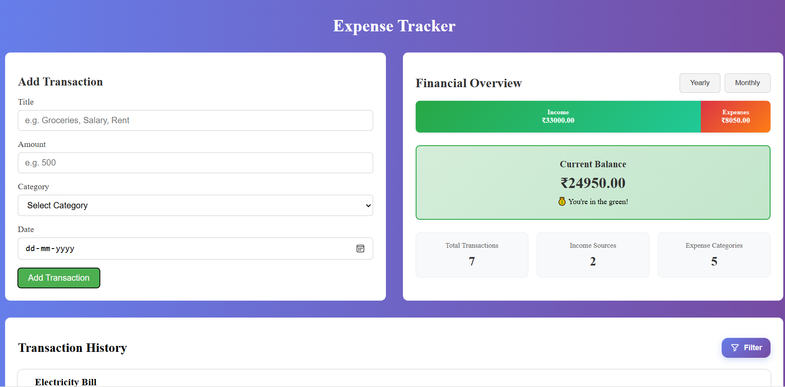
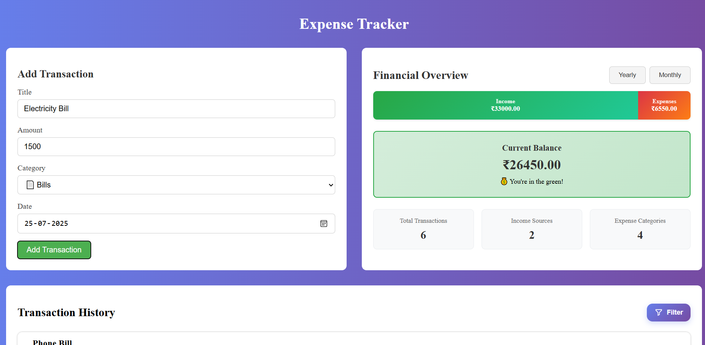
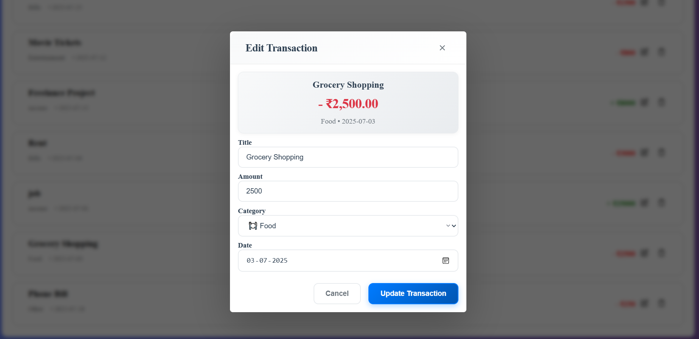
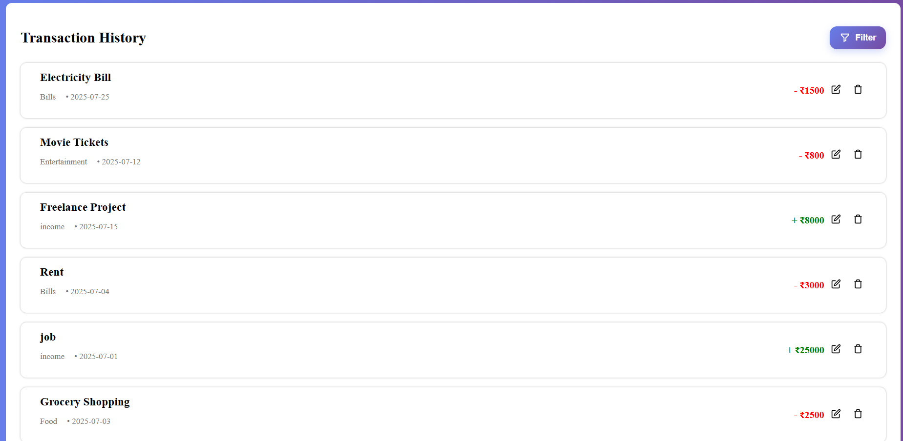
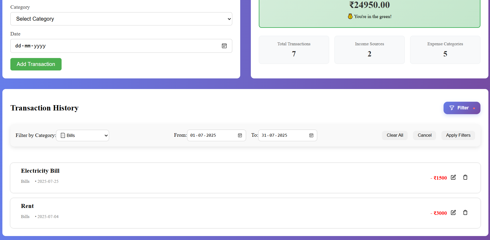

# 💰 Expense Tracker

A modern, responsive expense tracking application built with Angular 20. Track your income and expenses, categorize transactions, and manage your financial data with an intuitive interface.

## ✨ Features

- **📊 Interactive Dashboard** - Get an overview of your financial status at a glance
- **💰 Transaction Management** - Add, edit, and delete income/expense entries
- **📊 Transaction Overview** - Clear view of all your income and expense entries
- **🏷️ Category Organization** - Categorize transactions for better financial insights
- **💾 Local Storage** - Your data is automatically saved locally
- **📱 Responsive Design** - Works perfectly on desktop, tablet, and mobile devices
- **⚡ Real-time Updates** - See changes instantly across all components

## 🖼️ Screenshots

### Main Dashboard


_The main dashboard showing transaction summary and recent transactions_

### Add Transaction Form


_Form to add new income or expense entries with category selection_

### Edit Transaction Modal


_Modal for editing existing transaction details_

### Transaction History


_List view of all transactions with edit/delete actions_

### Filter Actions


_Interface showing transaction filtering and management options_

## 🚀 Getting Started

### Prerequisites

- Node.js (version 18 or higher)
- npm or yarn package manager
- Angular CLI (will be installed automatically)

### Installation

1. **Clone the repository**

   ```bash
   git clone https://github.com/ommisaidatta/expense-tracker.git
   cd expense-tracker
   ```

2. **Install dependencies**

   ```bash
   npm install
   ```

3. **Start the development server**

   ```bash
   npm start
   # or
   ng serve
   ```

4. **Open your browser**
   Navigate to `http://localhost:4200/` to view the application.

## 🛠️ Technology Stack

- **Frontend Framework**: Angular 20
- **Styling**: SCSS with modern CSS features
- **State Management**: RxJS BehaviorSubject
- **Data Persistence**: Local Storage
- **Build Tool**: Angular CLI

## 📁 Project Structure

```
src/
├── app/
│   ├── dashboard/                 # Main dashboard component
│   │   ├── components/
│   │   │   ├── expense-form/      # Add/edit transaction form
│   │   │   ├── summary-chart/     # Transaction summary and filtering
│   │   │   ├── transaction-list/  # Transaction display
│   │   │   └── edit-modal/        # Edit transaction modal
│   │   └── dashboard.ts          # Dashboard logic
│   └── services/
│       └── expense-service.ts     # Data management service
├── styles.scss                   # Global styles
└── main.ts                      # Application entry point
```

## 📱 Usage

### Adding Transactions

1. Use the form at the top of the dashboard
2. Select transaction type (Income/Expense)
3. Enter amount, title, category, and date
4. Click "Add Transaction"

### Editing Transactions

1. Click the edit icon on any transaction
2. Modify the details in the modal
3. Click "Save Changes"

### Deleting Transactions

1. Click the delete icon on any transaction
2. Confirm the deletion

### Viewing Summary

- Transaction summary is displayed automatically
- Data updates in real-time as you add/modify transactions
